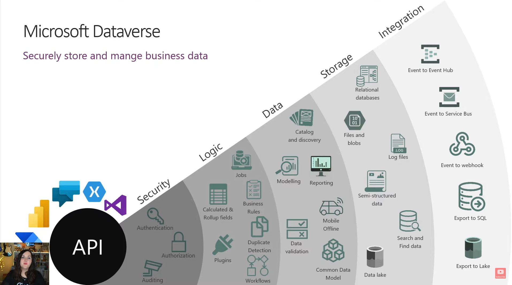

# Finns Analsyis of CRM Options

## Microsoft Dataverse 
Microsoft Dataverse is a cloud-based storage space. Dataverse allows you to securely store and manage data that's used by your business applications such as Microsoft Dynamics 365 and the Power Platform. Dataverse is not like access (not designed for stand-alone use on servers, need an internet connection to access it). All of the data is stored in the azra cloud.

### Pros
* Easy to Manage
* Secure
* Work with mobile, web or desktop apps
* Able to iimport and export data easily.
* Free with office 365

### Types of tables in dataverse
* Standard: Base set of tables created for every instance of a dataverse database.
* Complext: Tables that contain complex, server-side business logic (real time workflows, plugins, etc)

### Business Rules 
* Allow you to apply business logic at the data layer instead of the app layer
* If you create a business rule in dataverse, it's in effect regardless of where you interact with the data
* Used to set values, validate data, show error messages, show/hide columns etc. 

## Microsoft Power Platforms

### Power Apps
* Allows you to build custom business applications
* Canvas app: blank canvas where you can design exactly how you want the application to look. You use formulas with power fx to determine the application behaviour.
* Model driven app: starts with a data model. 
* Portal: if you want to interact with customers (customers can log in)

### Power Automate
* Cloud flows (automating processes)
* Business process flow
* Desktop automation (uses API)
* Process mining

### Power virtual agents
* Allows you to create chatbots with no code

### Power BI
* Analysis of data

## Types of licenses for Power Apps

### What office 365 license if provided by the University?
Microsoft 365 A5 for students

### Power Apps (office 365 license)
* Enables you to build apps in sharepoint. 
* What you can't do is connect to is connect to enterprise databases such as sql, salesforce CRM. Also only have 1 environment
* Can't do an application lifestyle management (test production)

### Power Apps premium license

## Integrating Dataverse with Sharepoint
Microsoft Dataverse supports integration with SharePoint that enables you to use the document management capabilities of SharePoint from within Dataverse. 

### To work with the coudement management capabilities of SharePoint from within Dataverse, you must:
1. Enable document anagement functionality for your environment
2. Set up SharePoint integratin from Power Platform admin center
3. Enable document management for tables
4. Configure the appropriiate from in Power Apps documents 
5. Create appropritate table permissin and assign it to the appropriate we role. 

## Proposed solution for CRM:
Use dataverse for backend, sharepoint for front end.
