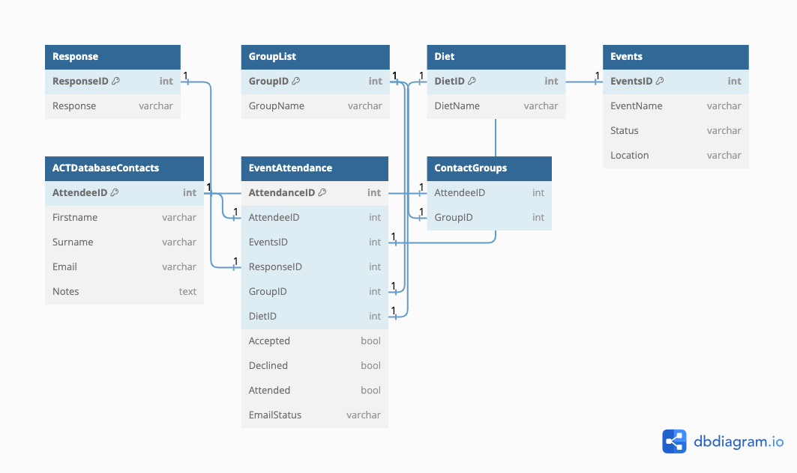

## Database Effectiveness Summary

### Centralized Data
- **What**: `EventAttendance` serves as the central hub for key metrics.
- **Why**: Enables quick and centralized understanding of event participation.

### Quick Answers
- **What**: Star schema structure for efficient querying.
- **Why**: Ideal for data aggregation like counting attendees or dietary preferences.

### Flexibility
- **What**: Designed to easily adapt to new requirements.
- **Why**: Simple to add a new type of response or diet by updating dimension tables.

### Detailed Reporting
- **What**: Built to handle complex reporting needs.
- **Why**: Allows for deep dives into various metrics like attendance patterns, and group behaviors.

### Scalability
- **What**: Built to grow with your organizational needs.
- **Why**: Additional fields or tables can be incorporated without breaking existing structure.

### Group Management
- **What**: Special table (`ContactGroups`) for multiple group assignments.
- **Why**: Allows nuanced targeting and analysis.

### Comprehensive Contact Info
- **What**: `ACTDatabaseContacts` table has extensive contact details.
- **Why**: Includes space for notes, better enabling relationship management.
